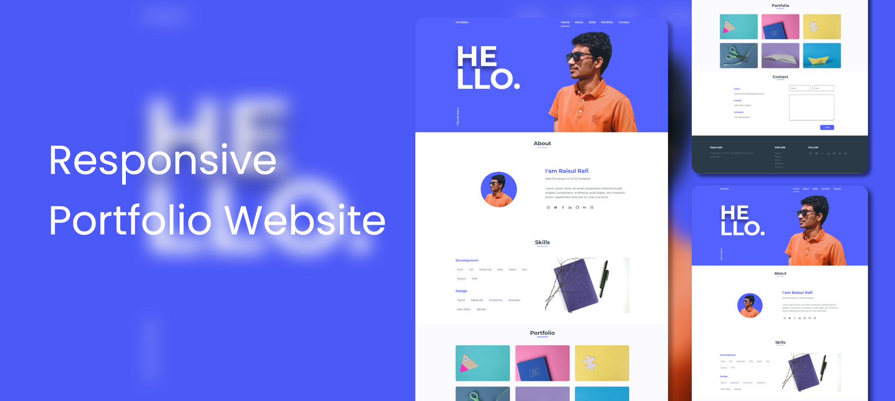

# Responsive Portfolio Website | NUYsDev 🖥️
## [Preview](#) | [UI Design](#)

### Include this Marketing Website ➡️

- Full Responsive byUsing HTML CSS & JavaScript.
- Mobile Friendly Design
- Fresh And Clean Code
- Smooth scrolling in each section.
- Developed first with the Mobile First methodology, then for desktop.
- Compatible with all mobile devices and with a beautiful and pleasant user interface.

## About Mine
## Hello 👋🏻, I'm Raisul Hasan Rafi. A Full-Stack Web Developer. 
### Also expert in UI-UX Design | WordPress Theme Development | Desktop Application Development | Android Application Development | 3D Game Development | NFT Art | Cartoon Animation | Motion Graphics | VFX | Search Engine Optimization (SEO) | Social Media Marketing | Photography and Video Editing | Content Writing & KyeWord ReSearch.

## Contact Me
### E-Mail: raisulhasanrafi3032@gmail.com
### | [Instagram](https://instagram.com/rhr_raisulrafi) | [Twitter](https://twitter.com/rhr_raisulrafi) | [LinkedIn](https://linkedin.com/in/rhr3032) | [Facebook](https://facebook.com/rhr.raisulrafi) | [Behance](https://behance.net/rhr3032) 
##
## Website: [NUYsDev](https://nuysdev.netlify.app/)
